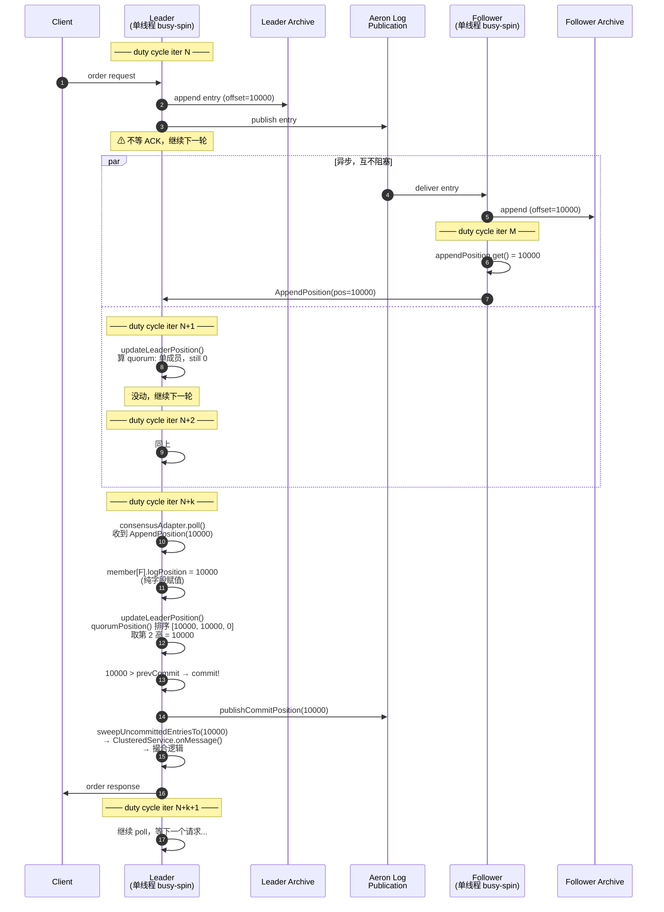
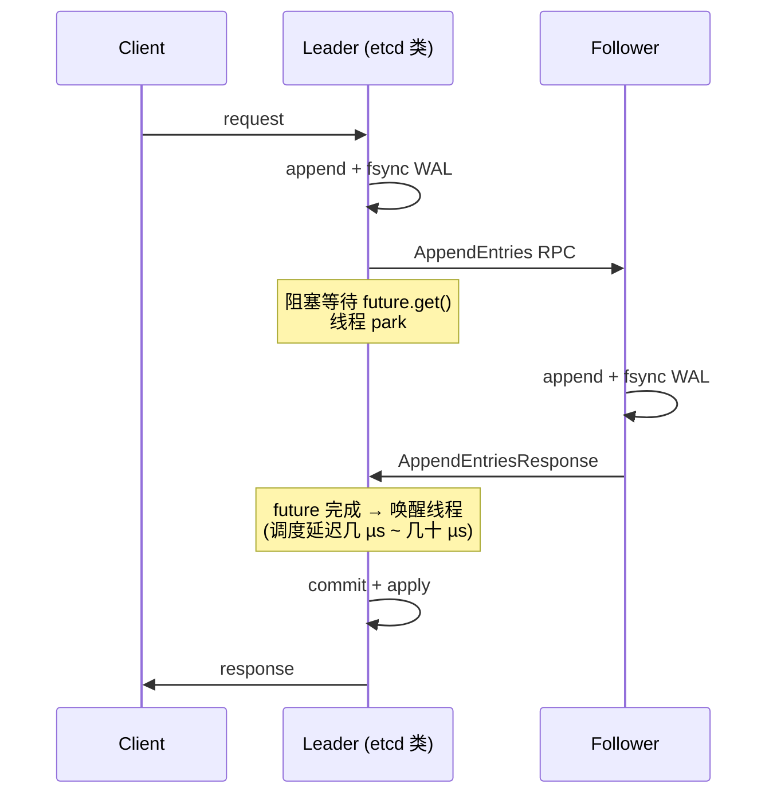

# Aeron Cluster 撮合系统：Raft 为什么不慢

> **调研日期**：2026-04-25
>
> **资料来源**：Aeron 官网、Adaptive 官网、案例页、AWS 行业博客、Aeron 开源仓库（`aeron-cluster/src/main/java/io/aeron/cluster/*`）。
>
> **讨论范围**：Aeron Cluster 在撮合/类撮合系统中的延迟表现，以及它的 Raft 实现与传统 Raft（etcd 类）的工程差异。背景问题是"撮合走 Raft 共识能快吗"。

## 1. 一句话结论

**Raft 慢的是"走 TCP + fsync + 跨 DC + 通用 KV 存储"那种实现。** Aeron Cluster 把这些瓶颈逐一替换：UDP+multicast 复制、quorum-in-memory、同机房 LAN、共享内存 log buffer、单线程零 GC 状态机——所以才有公司敢拿它做撮合。EDX Markets 的中位 round-trip 是 **73 µs**，已经胜过很多没用 Raft 的传统撮合系统。

## 2. 已公开使用 Aeron Cluster 跑撮合/类撮合的公司

### 撮合 / 交易所

| 用户 | 用途 | 已知数据 |
|---|---|---|
| **EDX Markets** | 机构级数字资产交易所（Citadel Securities、Fidelity、Schwab、Sequoia 等支持） | 中位往返延迟 **73 µs**，上线一年零计划外停机 |
| **Coinbase** | Coinbase Derivatives Exchange、Coinbase International Exchange | 24/7 交易+实时结算，已用 Aeron 8+ 年 |
| **LGO** | 加密货币交易所（已被收购）| 2019 起跑在 GCP 生产 |
| **Kepler Cheuvreux / KCx** | 算法执行平台，事件驱动 | Adaptive 案例 |
| **某 Tier-1 美国交易所** | 监管合规 Repo 撮合场所 | Adaptive 案例（未具名）|
| **某欧洲能源交易商** | 端到端云上交易+撮合 | Adaptive 案例 |

### 高频/做市/支付（Aeron 但不一定 Cluster）

- **Man Group** —— 低延迟 FX 报价处理
- **SIX Interbank Clearing** —— 瑞士即时支付平台（Cluster 的典型用例：HA + 强一致 + 低延迟）

### Adaptive 自有产品

- **Aeron Exchange Accelerator**：Adaptive 称已部署在多家 Tier-1/Tier-2 交易所，未具名。

## 3. 为什么这个 Raft 能跑出 µs 级延迟

### 3.1 复制不走 TCP，走 Aeron 自己的 UDP 协议

- 传统 Raft：leader→每个 follower 单独 TCP 流，每条 entry 一次 syscall。
- Aeron Cluster：log 是一条 publication，leader **一次 publish**，所有 follower 通过 multicast 或 MDC 同时收——一次内核调用搞定 N 个 follower。
- 物理层往往是 **kernel bypass**（Premium 卖点之一，跑 ef_vi/DPDK），单向延迟 1-3 µs 起。

### 3.2 Log 不在每次 commit 时 fsync

- 传统 Raft（etcd 等）默认 commit 前必须 fsync WAL，**SSD 上一次 fsync ~50-200 µs**——光这一步就把延迟封死了。
- Aeron Cluster 的 "log" 是 Aeron Archive 的 recording，**异步落盘**；持久化保证靠 quorum——3 节点中 2 节点收到内存即算 commit。
- 同机房 3 节点 LAN 上拿到 quorum ack 通常 **5-15 µs**。

### 3.3 Log 就是共享内存 ring buffer

- 不是 LevelDB / RocksDB / B-tree，是 mmap 的环形缓冲（Aeron LogBuffer），**append 是 wait-free CAS**。
- 状态机和 log 在同一个 JVM 进程，applied 不需要跨进程。

### 3.4 单线程 + mechanical sympathy

- ClusteredService（业务状态机）**单线程跑**，CPU pinning，无锁。
- 没有 GC pause（off-heap、对象池、零分配热路径）。
- L1/L2 cache 友好的 SBE 二进制编码。

### 3.5 拓扑：3 节点同机房，不跨城共识

- Raft quorum 设计在 **本地 LAN 内**（同 AZ 或同机房）。
- 跨机房 DR 用 **Cluster Standby**（旁路复制，不进 quorum），跨城延迟根本不进入热路径。
- 详见 §6。

## 4. 共识协议工作机制：NAK + AppendPosition + 单线程轮询

§3 是分点解释，这一节把"一条 entry 从写入到 commit"的完整时序画出来，并指出和传统 Raft 实现的区别。

### 4.1 两层不同的 ACK 机制

Aeron Cluster 同时用了两套机制，要分清楚：

| 层 | 机制 | 用途 |
|---|---|---|
| **数据面（Aeron 传输）** | **NAK-based** | log 复制传输。publisher 发了不等回应，subscriber 检测到序号空洞才发 NAK 触发重传。正常情况下 0 个 ACK 报文。 |
| **共识面（Cluster Raft）** | **AppendPosition** | commit 决策。follower 主动周期性地推一个 control 消息给 leader，告诉它 "我现在的 log 末尾是 X"。 |

NAK 只省掉了"传输层的逐包 ACK 开销"，**Raft commit 仍然必须有正向位置确认**——你不能假设"没人反对就算同意"，否则 leader 挂了会丢已确认订单。

### 4.2 AppendPosition 是位置型批量 ACK

关键代码在 `ConsensusModuleAgent.java:2687`：

```java
private int updateFollowerPosition(final long nowNs) {
    final long recordedPosition = appendPosition.get();  // 当前 archive 写到哪
    // ...
    if (position > lastAppendPosition ||
        nowNs >= (timeOfLastAppendPositionSendNs + leaderHeartbeatIntervalNs)) {
        consensusPublisher.appendPosition(publication, ..., position, ...);
    }
}
```

每一轮 follower duty cycle 调一次。一条 `AppendPosition` 携带的是"我现在的 log 末尾"，所以**一条消息能 ACK 自上次发送以来积累的任意条数 entry**：

- 高负载（每轮都有新 entry）：每轮一次，一次 ACK 这一轮新增的 N 条
- 低负载（偶尔来一条）：那一条立刻触发，下一轮就发（接近 per-entry，最低延迟）
- 空闲：按 heartbeat 间隔发维持存活

### 4.3 Leader 不"等"，是"轮询发现"

Leader 的 duty cycle 伪代码：

```java
while (running) {
    ingressAdapter.poll();           // 收 client 请求 → 写 log
    consensusAdapter.poll();          // 收 follower AppendPosition → 改 member.logPos
    updateLeaderPosition(nowNs);      // 算 quorum → 可能 commit
    sweepUncommittedEntriesTo(...);  // 已 commit 的喂状态机 → 回 client
    idleStrategy.idle(workCount);    // busy-spin / yield / park
}
```

收到 follower 的 `AppendPosition` 干的事就是改一下数组里那个 follower 对象的 `logPosition` 字段——纯字段赋值（`ConsensusModuleAgent.java:1055`）：

```java
void updateMemberLogPosition(ClusterMember member, ...) {
    member.logPosition(logPosition)
          .timeOfLastAppendPositionNs(...);
}
```

之后 leader 自己每轮 duty cycle 都会调 `quorumPosition()`（`ClusterMember.java:867`）：

```java
// 把所有活跃 member 的 logPosition 排序，取第 N 个
// 3 节点 quorum=2，取第 2 高
// 5 节点 quorum=3，取第 3 高
return rankedPositions[length - 1];
```

发现 quorum 跨过新位置就 commit、广播 commitPosition、扫积压请求回 client。**没有 wait/notify、没有 callback、没有 future**——这些机制本身的延迟（µs 级线程唤醒）在 µs 级目标下都太贵。

### 4.4 数据流时序图（Aeron Cluster）



要点：

- **step 4 "不等 ACK"** 是和传统实现最大的区别。leader 把 entry 推到 publication 后**直接进入下一轮 duty cycle**。
- **par 块**表达"两个流程并行各自轮询"——transport 异步投递 + follower 自己 duty cycle 报位置回来；leader 在这段时间里一直在转 duty cycle，每轮都算 quorum，只是 quorum 没动。
- **step 11-15** commit 触发是"轮询发现"，不是"事件唤醒"——leader 不是被 follower 的消息唤醒的，是它**正常进入下一轮 duty cycle**，在 `consensusAdapter.poll()` 这一步主动读到了。

### 4.5 对比时序图（传统 Raft，etcd 类）



每个 ↔ 都是同步等待，每个唤醒都有调度成本。Aeron Cluster 把这些全替换成单线程轮询了。

### 4.6 设计模式名称

业内叫法是 **SEDA**（Staged Event-Driven Architecture）或者**共享状态 + 周期轮询**模式。核心：

- 没有"请求 → 响应 → callback"的链式等待
- 没有 condvar / future / channel——这些都会引入唤醒延迟（µs 级，致命）
- 所有"等待"都变成"轮询本地内存计数器"——L1 cache hit 是 ns 级
- 多个独立流程靠**共享内存的位置变量**通信，谁需要谁自己去看

## 5. 实测延迟分解（典型撮合）

```
客户端 → leader            ~5 µs   (Aeron UDP one-way)
leader 写 log + publish    ~1 µs   (memcpy + atomic)
follower 收到 + ack        ~5 µs   (return UDP)
leader 看到 quorum         ~1 µs
状态机 apply + 响应        ~5 µs   (业务逻辑)
leader → 客户端            ~5 µs
                          ─────
                          ~22 µs ingress→egress
```

EDX 的 73 µs 是"客户端 round-trip"，再加上 gateway、SBE 编解码、撮合逻辑本身，对得上。

## 6. 跨 DC 灾备：Premium Cluster Warm Standby

为了不让"跨城共识"毁掉 Raft 延迟，Adaptive 把 DR 拆到 quorum 之外：

- **active cluster** 跑在主 DC（3 节点 Raft，低延迟内网，热路径）。
- **standby 节点** 跑在异地 DC，通过类似开源 `ClusterBackupAgent` 的 archive→archive 复制通道**单向消费日志**，但额外把日志喂给本地 ClusteredService，让内存状态机跟 leader 几乎同步（"warm"）。
- **不参与 quorum**，所以 standby 网络再慢也不会拖 leader commit。
- 灾备切换是**手动翻 flag**（"typically by a human operator"），符合金融场景的合规要求；切换后 RTO 是秒级，因为不需要 replay log。
- 顺带提供 **Query Offload**：把只读查询从 active 摘到 standby，减轻 leader egress 压力。

与开源 `ClusterBackup` 的差别：

| 维度 | OSS ClusterBackup | Premium Cluster Standby |
|---|---|---|
| 是否执行业务状态机 | ❌ 只复制日志 | ✅ 实时执行，内存状态与 leader 同步 |
| 故障恢复 | 冷启动 + replay，RTO 长 | flag 切换，秒级 |
| 数据丢失 | 取决于复制延迟 | 限于"in transit, not yet committed on standby" |
| 是否能服务请求 | 否 | 是（只读 Query Offload）|
| 与 leader 的耦合 | 异步 archive 复制 | 异步消费但不参与 quorum |

## 7. 什么时候 Aeron Cluster 也快不起来

- **跨地域 quorum**——比如北京-上海 3 节点 Raft，单向 RTT 30 ms 直接封顶。这种就只能用 Premium Standby 旁路复制，热路径仍留在单一机房。
- **业务状态机本身慢**——撮合逻辑写得不好（GC、跨缓存行竞争），Raft 多快都没用。
- **fsync 真的开了**（ChannelEndpoint 配 `fsync` 强一致写盘）——延迟从 µs 跳到 100 µs+。Aeron 默认不开，是个有意识的取舍。
- **未做 NIC/CPU 调优**——没绑核、没禁中断、没关 C-state、跑在云通用实例上：µs 级目标不可能。

## 8. 对 OpenTrade 的启示

- "Raft 不能上撮合"这个直觉只在传统 Raft 实现里成立。要不要走 Aeron Cluster 路线，关键看：
  1. 撮合是否需要"多副本强一致 + 单点故障秒级切换"（监管/合规场景几乎是必须）。
  2. 能否在**单机房 LAN** 内部署 3 节点 Raft，把跨城放到 Standby。
  3. 团队是否能接受 JVM/C 的 mechanical sympathy 风格（off-heap、无锁、零分配）——Aeron 的延迟靠这套实现习惯，写法不对会全部退化。
- 如果不要求强一致 quorum、可以容忍主备异步切换的小窗口数据丢失，那走柜台-撮合 p2p UDP + 异步落盘的路线（参见 `cex-counter-match-aeron-research.md`）就够了，不必引入 Cluster 的复杂度。

## 9. 参考资料

- [EDX Markets 案例](https://aeron.io/case-studies/edxm-low-latency-exchange/)
- [Coinbase 案例](https://aeron.io/case-studies/coinbase-cloudnative-crypto-exchange-aeron-cluster/)
- [Aeron Cluster Standby（Premium）](https://aeron.io/aeron-premium/aeron-cluster-standby/)
- [High Availability — OSS Cluster Backup](https://aeron.io/docs/cluster-quickstart/high-availability/)
- [Adaptive — Aeron Exchange Accelerator](https://weareadaptive.com/aeron-exchange-accelerator/)
- [Aeron performance on AWS（capital markets）](https://aws.amazon.com/blogs/industries/aeron-performance-enables-capital-markets-to-move-to-the-cloud-on-aws/)
- [Aeron 全部 case studies](https://aeron.io/case-studies/)
- 仓库内 `aeron-cluster/src/main/java/io/aeron/cluster/ClusterBackupAgent.java`（OSS backup 实现，warm standby 的基础设施）
